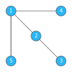
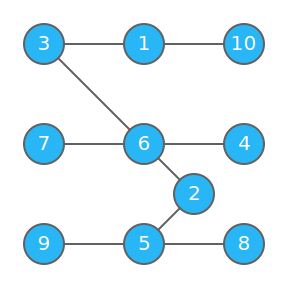

## 题目描述

有一棵包含 $n$ 个顶点的树 $G=(V,E)$。

对于边的子集 $S$，定义 $\operatorname{forest} S$ 为仅连接 $S$ 中的边形成的森林，$f(S)$ 为 $\operatorname{forest}S$ 中每个连通块的重心的标号和。值得注意的是，一个连通块可能有两个重心。

对于所有的 $2^{n-1}$ 种 $S$，请求出他们的 $f$ 的和，即 $\sum_{S\subseteq E} f(S)$ 的值。输出的答案对 $998244353$ 取模。

## 输入格式

第一行输入一个整数 $n$，表示树的大小。

接下来的 $n-1$ 行每行一条输入两个整数 $u$ 和 $v$，表示点 $u$ 和点 $v$ 之间有一
条连边。

## 输出格式

一行输出一个整数，表示对 $998244353$ 取模的答案。

## 样例数据

### 样例 1 输入

```plain
5
1 2
2 3
1 4
1 5
```

### 样例 1 输出

```plain
165
```

### 样例 1 解释

样例中输入的树结构如下：



### 样例 2 输入

```plain
10
1 3
2 5
6 7
2 6
3 6
4 6
9 5
5 8
1 10
```

### 样例 2 输出

```plain
18759
```

### 样例 2 解释

样例中输入的树结构如下：



### 样例 3

见下发文件 `ex_tree3.in` 和 `ex_tree3.out`，该测试用例满足子任务 2 的约束
条件。

### 样例 4

见下发文件 `ex_tree4.in` 和 `ex_tree4.out`，该测试用例满足子任务 3 的约束
条件。

### 样例 5

见下发文件 `ex_tree5.in` 和 `ex_tree5.out`，该测试用例满足子任务 4 的约束
条件。

### 样例 6

见下发文件 `ex_tree6.in` 和 `ex_tree6.out`。

## 数据规模与约定

全部数据均保证 $1\le n\le 6000$，$1\le u,v\le n$，并且保证输出的边组成一颗树。

本题采用子任务捆绑测试，各个子任务详细信息如下：

| 编号  | 子任务分数 | $n,q\le$ |
|:---:|:-----:|:--------:|
| 1   | 10    | $10$     |
| 2   | 20    | $100$    |
| 3   | 15    | $500$    |
| 4   | 15    | $3000$   |
| 5   | 40    | $6000$   |
